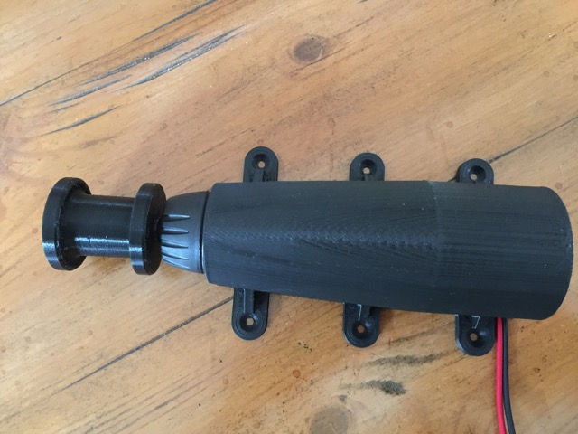
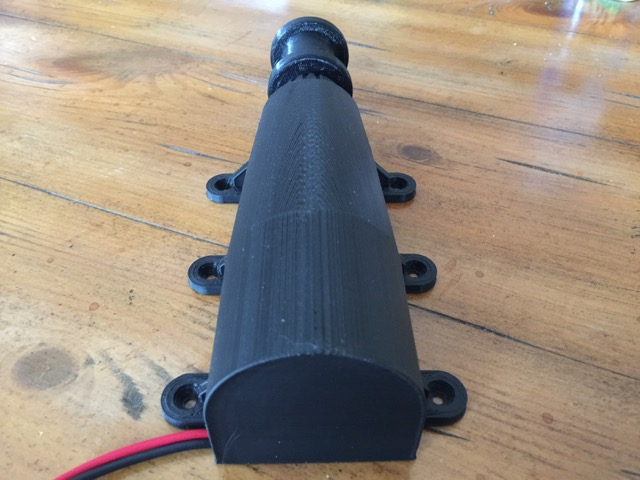
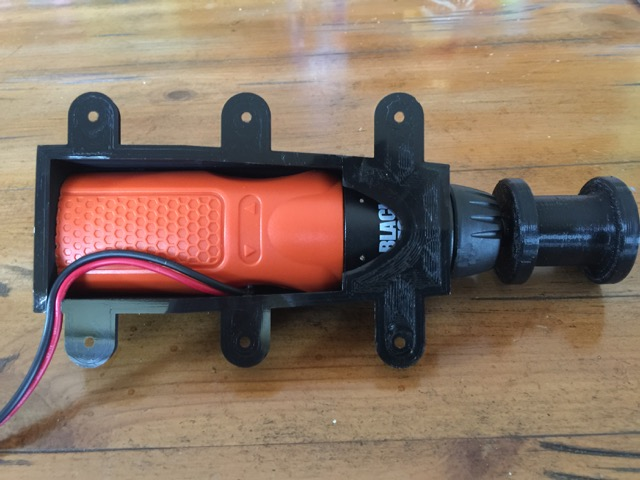
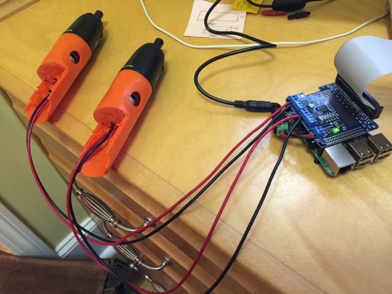

# SJ Acres' Automatic Chicken Coop Door Opener

For the [IOT Chicken Coop](https://github.com/sjacres/iot-chicken-coop), we needed automatic door openers.  I am using a [Black & Decker AS6NG Alkaline Cordless Screwdriver](https://amzn.com/B004HY3APW) as the motor to open/close the door.  I cut off part of the handle & removed the switch to wire the motor to a [Adafruit DC & Stepper Motor HAT for Raspberry Pi](https://amzn.com/B00TIY5JM8).  These were the first parts that I designed with [OpenSCAD](http://www.openscad.org), so I am sure that there maybe some techniques that I could learn more about.

